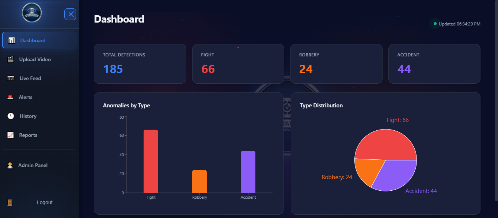
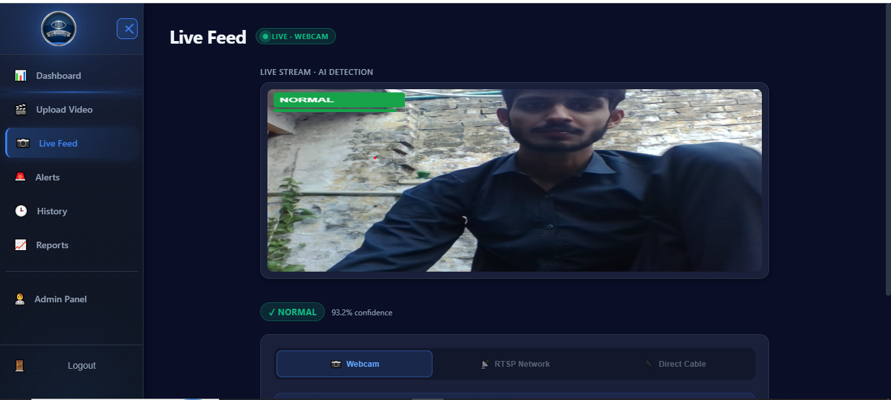
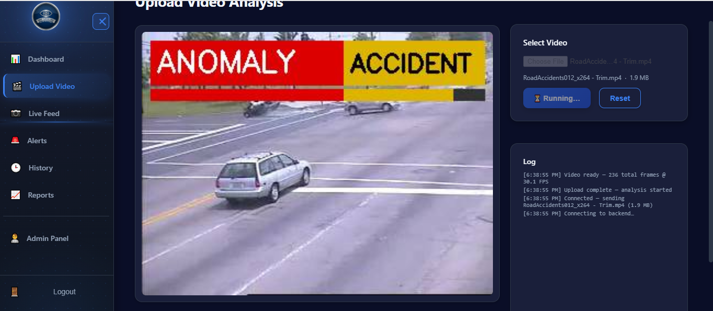
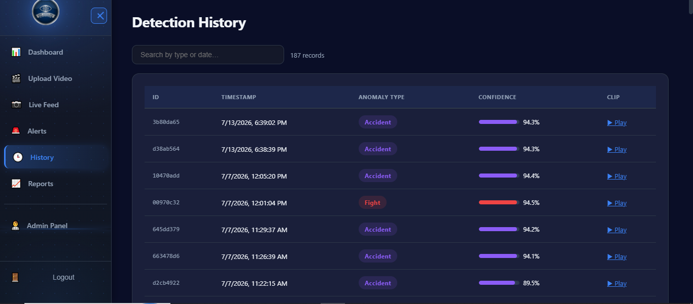

<div align="center">


# Smart Surveillance System

**Real-time anomaly detection for CCTV & video using deep learning.**
Automatically detects **Fights, Robberies, and Accidents** in live camera feeds or uploaded footage, saves the incident clip, and sends instant email alerts.


</div>

---

## 📌 Overview

The Smart Surveillance System is a full-stack application that watches video streams and flags dangerous events **as they happen**. It uses a **two-stage deep learning pipeline**:

1. **Stage 1 — Anomaly Detector:** decides whether a short video clip is `Normal` or `Anomaly`.
2. **Stage 2 — Anomaly Classifier:** if an anomaly is found, classifies it as `Fight`, `Robbery`, or `Accident`.

When an anomaly is detected, the system automatically **records the clip**, **uploads it to the cloud**, **logs it to the database**, and **emails an alert** — so nobody has to stare at a monitor all day.

> 📖 A deep technical write-up (model architecture, inference pipeline, API reference, database schema) lives in **[SYSTEM_DOCUMENTATION.md](SYSTEM_DOCUMENTATION.md)**.

---

## ✨ Features

- 🎥 **Live detection** from a webcam or an **RTSP / CCTV** camera stream (over WebSockets)
- 📤 **Upload & analyze** pre-recorded video files
- 🧠 **Two-stage AI pipeline** — EfficientNet-B0 + Bidirectional GRU + Attention
- 💾 **Automatic incident clips** saved and uploaded to Cloudinary
- 📧 **Instant email alerts** with the incident clip attached (Gmail SMTP)
- 🗄️ **Detection history** stored in Firebase Realtime Database
- 📊 **Dashboard & reports** — charts, monthly summaries, PDF export
- 🔐 **Admin login** with JWT authentication
- ⚙️ **Configurable settings** (email, detection sensitivity) editable from the UI

---


| Dashboard | Live Feed |
|-----------|-----------|
|  |  |

| Upload & Analyze | Detection History |
|------------------|-------------------|
|  |  |

---

## 🏗️ Architecture

```
┌─────────────────────────────────────────────────────────────┐
│                    Smart Surveillance System                 │
│                                                              │
│  Frontend (React + Vite)          Backend (FastAPI)          │
│  ┌─────────────────┐              ┌──────────────────────┐   │
│  │  Live Feed Page │◄──WebSocket──│  stream_router.py    │   │
│  │  Upload Page    │◄──WebSocket──│  video_router.py     │   │
│  │  History / Dash │◄────HTTP─────│  detection_router.py │   │
│  │  Admin / Login  │◄────HTTP─────│  auth_router.py      │   │
│  └─────────────────┘              └──────────┬───────────┘   │
│                                              │               │
│                          ┌───────────────────┼─────────────┐ │
│                          ▼                   ▼             ▼ │
│                     ML Models (PyTorch)  Firebase     Cloudinary
│                     Stage 1 → Stage 2   (Database)    (Clips) │
└─────────────────────────────────────────────────────────────┘
```

**Tech stack:** Python 3.11 · FastAPI · Uvicorn · PyTorch · OpenCV · React 18 · Vite · Firebase · Cloudinary

---

## 📂 Project Structure

```
FYP/
├── backend/
│   ├── main.py                 # FastAPI entry point
│   ├── config.py               # Configuration (reads secrets from .env)
│   ├── .env.example            # Environment variables template
│   ├── requirements.txt        # Python dependencies
│   ├── models/                 # Model architecture + loader (Stage 1 / Stage 2)
│   ├── saved_models/           # Trained weights (.pth)
│   ├── routers/                # API + WebSocket endpoints
│   ├── services/               # Inference pipeline, clip storage, email alerts
│   └── database/               # Firebase client + detection repository
├── frontend/
│   ├── src/
│   │   ├── pages/              # Dashboard, LiveFeed, Upload, History, Admin, ...
│   │   ├── services/           # API + auth clients
│   │   └── config.js           # Backend URL config
│   ├── package.json
│   └── vite.config.js
├── SYSTEM_DOCUMENTATION.md      # Full technical documentation
└── README.md
```

---

## 🚀 Getting Started

### Prerequisites

- **Python 3.11**
- **Node.js 18+** and npm
- (Optional) A **Firebase** project, a **Cloudinary** account, and a **Gmail App Password** for full functionality. The app can run in a limited mode without them.

### 1. Clone the repository

```bash
git clone https://github.com/<your-username>/smart-surveillance-system.git
cd smart-surveillance-system
```

### 2. Backend setup

```bash
cd backend

# Create & activate a virtual environment
python -m venv venv
# Windows:
venv\Scripts\activate
# macOS/Linux:
# source venv/bin/activate

# Install dependencies
pip install -r requirements.txt

# Install PyTorch separately (choose the build for your machine):
#   CPU:  pip install torch torchvision --index-url https://download.pytorch.org/whl/cpu
#   GPU:  see https://pytorch.org for the CUDA version matching your driver
```

### 3. Configure secrets

```bash
# Still inside backend/
cp .env.example .env          # Windows: copy .env.example .env
```

Open `.env` and fill in your own values (email, Firebase, Cloudinary, admin password).
For Firebase, also download your service-account key and save it as
`backend/firebase_credentials.json` (use `firebase_credentials.example.json` as a guide).

> 💡 **No Firebase/Cloudinary/email yet?** Set `FIREBASE_ENABLED=false` and `EMAIL_ENABLED=false` in `.env` to run the detection engine locally without them.

### 4. Frontend setup

```bash
cd ../frontend
npm install
```

### 5. Run it

**Terminal 1 — backend:**
```bash
cd backend
python main.py          # serves on http://127.0.0.1:8000
```

> If `python main.py` doesn't start the server, run it directly with Uvicorn:
> ```bash
> py -3.11 -m uvicorn main:app --reload --host 0.0.0.0 --port 8000
> ```

**Terminal 2 — frontend (dev):**
```bash
cd frontend
npm run dev             # serves on http://127.0.0.1:5173
```

Open **http://127.0.0.1:5173** in your browser.

> To serve the app as a single deployment, run `npm run build` in `frontend/` — the FastAPI backend will serve the built frontend from `frontend/dist`.

---

## 👥 User Roles & Login

The system has **two types of accounts**:

| Role | How to log in | Access |
|------|---------------|--------|
| **Admin** | Username & password from `.env` — default **`admin` / `admin123`** | Full access, including the **Admin** page to manage the security personnel account |
| **Security Personnel** | The **email & password** the admin sets for them | Day-to-day monitoring — live feeds, uploads, history, alerts |

**Creating / changing the security personnel account:**

1. Log in as **admin**.
2. Go to the **Admin** page.
3. Add a security personnel account — set their **name, email, and password** (you can also update or change these later from the same page).
4. Log out, then log in with those **security personnel credentials** (their email + password).

> ℹ️ The admin credentials are fixed in `.env` (change `ADMIN_USERNAME` / `ADMIN_PASSWORD` there). Security personnel accounts are created and managed by the admin and stored in Firebase.

---

## 🧠 The AI Model

Both stages share the same architecture, trained separately:

```
Video clip (16 frames) → EfficientNet-B0 → BiGRU → Attention → Classifier
```

- **EfficientNet-B0** extracts spatial features per frame
- **Bidirectional GRU** models motion/temporal patterns across frames
- **Attention** weights the most important frames
- Input: 16 frames at 224×224, sampled every 3rd frame (~1.6 s window at 30 fps)

Trained weights (`modelA_best.pth`, `model3c_best.pth`) are included under `backend/saved_models/`.

---

